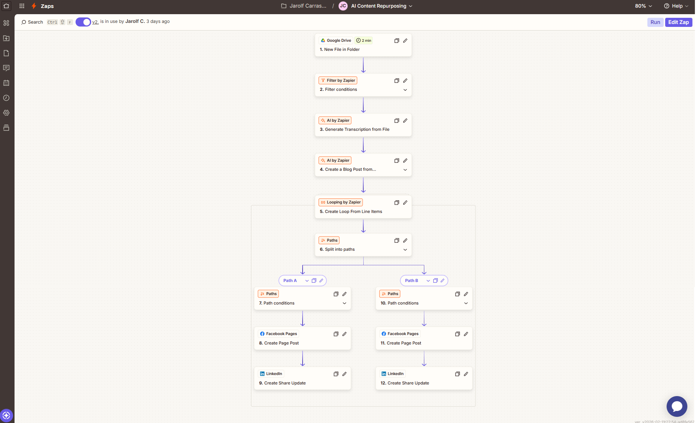
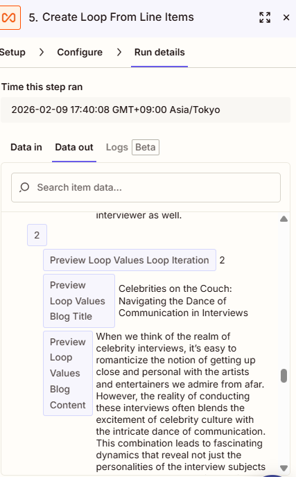
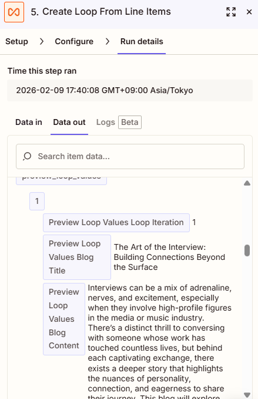
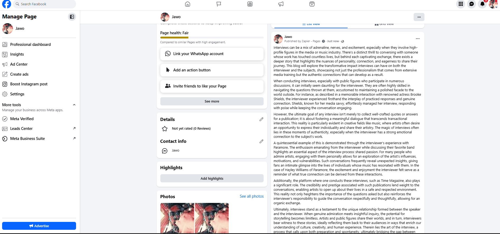
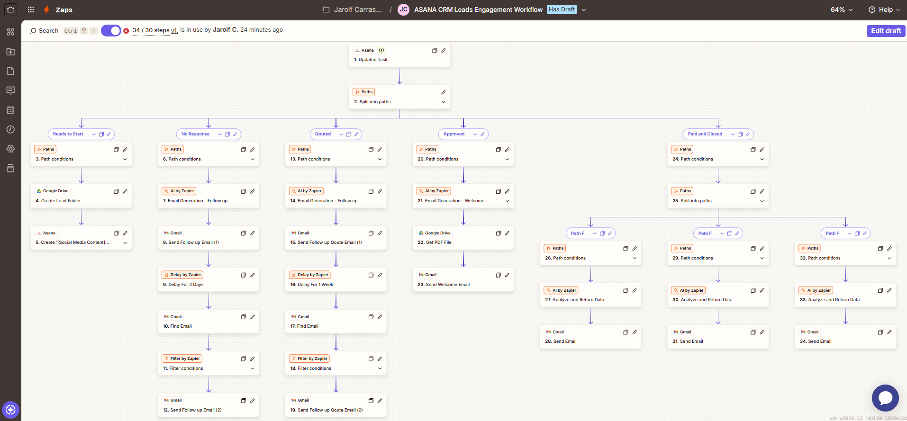
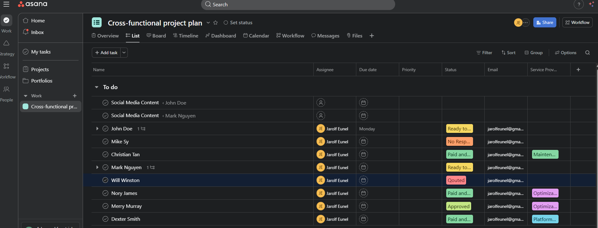
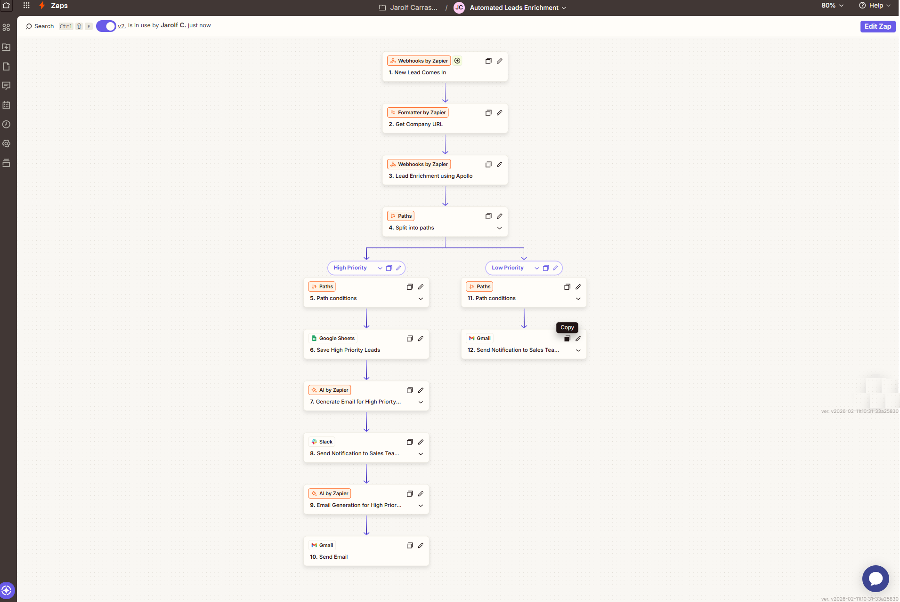
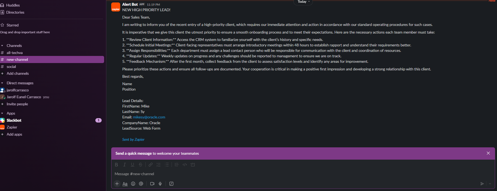

# Zapier Automation Portfolio
This repository contains my Zapier automation projects built to simplify workflows, automate repetitive tasks, and connect multiple platforms into efficient systems.
Projects include real-world automation solutions, AI integrations, and business productivity workflows.

--

## 📂 Project Navigation

- [Project 1: AI Repurposing Content](#project-1-ai-repurposing-content)
- [Project 2: ASANA CRM Leads Engagement Workflow](#project-2-asana-crm-leads-engagement-workflow)
- [Project 3: Lead Enrichment Workflow](#project-3-lead-enrichment-workflow)
---

## Projects

--

### Project 1: AI Repurposing Content
This workflow automatically repurposes existing content from audio files into two unique blog posts using AI. The workflow then publishes both blog posts across multiple social media platforms (Facebook, Instagram, Twitter, etc.), This helps to streamline content production and distribution.

---

#### Workflow Screenshots

##### 🔹 Full Workflow Overview

**Explanation:**  
This screenshot displays the complete Zapier workflow showing how audio content is processed, using AI transcript audio to text and converted into blog content, and distributed across multiple platforms.

##### 🔹 AI Content Generation Step

##### 🔹 Social Media Distribution Step

*Note: Different blog was captured in LinkedIN and Facebook, but those two different generated blog was posted both in LinkedIN and Facebook. Two blog post per platform.*

---

#### What I Did
- Designed automated content repurposing workflow
- Integrated AI to generate blog content variations
- Built multi-platform distribution automation
- Implemented workflow triggers, filters, and error handling

---

#### Tools & Integrations
- Zapier
- OpenAI
- Social Media Platforms
- Cloud Storage
- Audio Processing Tools

---

#### Business Value / Impact
- Reduces content production time
- Increases content output consistency
- Eliminates repetitive manual content creation
- Improves marketing efficiency and reach

---
---

###  Project 2: ASANA CRM Leads Engagement Workflow
This workflow automates lead engagement and tracking using Asana as a CRM system to improve follow-up efficiency and lead management.

---

#### Workflow Screenshots

##### 🔹 Full Workflow Overview

**Explanation:**  
This screenshot displays the complete lead engagement automation workflow. It shows how new leads are captured, tasks are created in Asana, and automated follow-ups are triggered.

---

#### What I Did
- Designed automated CRM lead management workflow
- Built lead capture and task assignment automation
- Implemented automated follow-up and engagement reminders
- Structured CRM-style lead tracking using Asana

---

#### Tools & Integrations
- Zapier
- Asana (CRM System)
- Email Automation Tools

---

#### Business Value / Impact
- Improves lead response speed
- Prevents missed follow-ups
- Centralizes lead management
- Reduces manual CRM updates
- Improves sales and engagement efficiency

---
---

### 🔎 Project 3: Lead Enrichment Workflow

This workflow automatically enriches new leads by collecting additional data such as company details, contact information, and lead insights using Apollo. The enriched data helps to identify if a high priority client comes in.

---

#### Workflow Screenshots

##### 🔹 Full Workflow Overview

**Explanation:**  
This screenshot shows how new leads are processed through enrichment tools to gather additional business and contact data.

---

#### What I Did
- Designed automated lead enrichment workflow
- Integrated external data enrichment tools
- Built automated CRM data updating process
- Implemented validation and filtering logic

---

#### Tools & Integrations
- Zapier
- Apollo - Lead Enrichment APIs / Tools
- CRM Platform

---

#### Business Value / Impact
- Improves lead quality and qualification
- Enables personalized outreach strategies
- Enhances sales targeting accuracy
- Saves time on manual lead research
- Increases conversion opportunities

---
---

## Portfolio Summary

This repository showcases a collection of automation workflows designed to improve business efficiency, reduce manual processes, and integrate multiple platforms into streamlined systems. The projects included demonstrate practical automation use cases involving CRM management, AI-driven content workflows, lead processing, and multi-platform integrations.

Each workflow highlights my approach to building scalable, reliable, and business-focused automation solutions. As automation technology continues to evolve, this portfolio will grow to include more advanced workflows, integrations, and AI-powered solutions.

---

If you would like to collaborate or discuss automation solutions:

- LinkedIn: [[Add Link](https://www.linkedin.com/in/jarolf-eunel-carrasco-092038136 )]
- Email: [jarolfcarrasco@gmail.com]

---

⭐ Thank you for visiting my automation portfolio.

